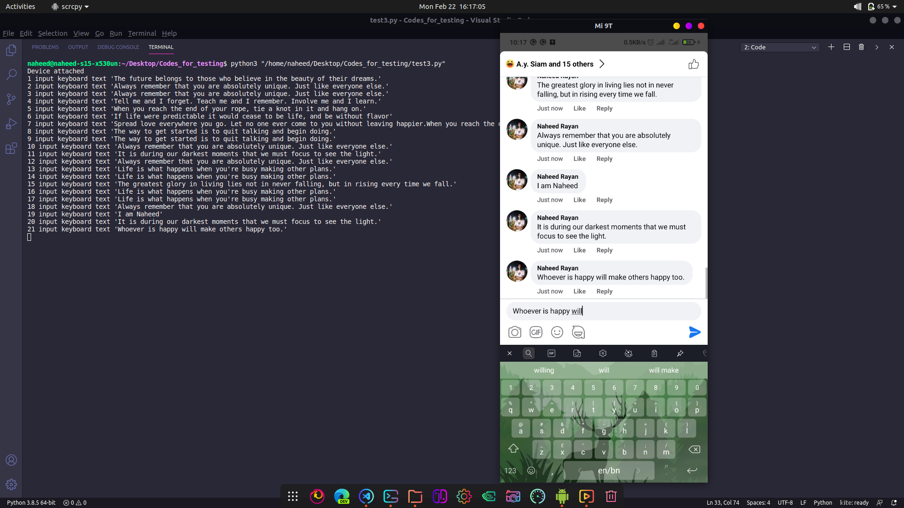

# automation-adb-comment-bot
Spam bot using python and adb

## Desclaimer :This is for educational purpose only



<br>

```python
from ppadb.client import Client 
from time import sleep
import random


# for connecting the device
adb = Client(host = '127.0.0.1' , port = 5037)

devices = adb.devices()

if len(devices) == 0:
    print('No devices attached')
    quit()

print('Device attached')
device = devices[0]


list_of_comments = ["The greatest glory in living lies not in never falling, but in rising every time we fall." , 
"The way to get started is to quit talking and begin doing." ,
"If life were predictable it would cease to be life, and be without flavor" , 
"Life is what happens when you're busy making other plans." , 
"When you reach the end of your rope, tie a knot in it and hang on." ,
"Always remember that you are absolutely unique. Just like everyone else.",
"Tell me and I forget. Teach me and I remember. Involve me and I learn.",
"Whoever is happy will make others happy too.",
"Spread love everywhere you go. Let no one ever come to you without leaving happier."
"When you reach the end of your rope, tie a knot in it and hang on.",
"Always remember that you are absolutely unique. Just like everyone else.", 
"The future belongs to those who believe in the beauty of their dreams.",
"It is during our darkest moments that we must focus to see the light.",
"I am Boss baby"]

# number of comments
x = len(list_of_comments)

cnt = 0 

while True:
    # getting a random comment from the list
    string = list_of_comments[random.randint(0 , x -1)]

    # getting a random time from  <= a < 6 sec
    # .random module is for miliseconds
    a = random.randint(3, 6) + random.random()
    # msg = f"Sleeping for {a : .4} sec"
    # print(msg)
    sleep(a)

    # making the shell command and inputing it
    string = f"input keyboard text '{string}'"
    device.shell(string)
    # clicking the enter button at pos (x , y) 
    device.shell('input tap 997 1561')

    # for counting the number of messages
    cnt += 1
    print(f"{cnt} {string}")

    if cnt == 150 :
        print('In deep sleep mode')
        cnt = 0 
        sleep(1800)

```


<br>

# The End
